# HoneySSH 开发文档

## 一、项目结构

```shell
├── doc                             # 开发文档
├── docker-compose.yml              # docker-compose 配置文档
├── Dockerfile                      # Dockerfile 配置文档
├── filesystem                      # 虚假的文件系统，pickle序列化导出
├── hfs                             # 虚假文件系统的文件内容
│   ├── etc
│   │   ├── group
│   │   ├── hostname
│   │   ├── hosts
│   │   ├── issue
│   │   ├── passwd
│   │   ├── resolv.conf
│   │   └── shadow
│   └── proc
│       ├── cpuinfo
│       ├── meminfo
│       └── version
├── honeySSH                        # 代码部分
│   ├── commands                    # 蜜罐内具体指令的实现
│   │   ├── base.py                 # 基础的一些指令，如cd, ls, whoami等
│   │   ├── filesystem.py           # 与文件系统操作相关的指令，如：cp, mv, touch, mkdir等
│   │   ├── __init__.py
│   │   └── ping.py                 # ping指令
│   ├── core                        # 核心代码部分
│   │   ├── config.py               # 导入配置文件
│   │   ├── honeyCMD.py             # 上面指令系统开发的父类，写了细写指令的基础部分
│   │   ├── honeyFilesystem.py      # 虚假文件系统的相关代码
│   │   ├── honeyProtocol.py        # 重构twisted的terminal相关类，插入我们的文件系统、指令系统和日志系统
│   │   ├── __init__.py
│   │   ├── log.py                  # 日志记录的相关代码
│   │   ├── ssh.py                  # 重构twisted的ssh相关类，插入我们的文件系统、指令系统和日志系统
│   │   └── utils.py                # 工具相关函数
│   └── __init__.py
├── log                             # 日志存储地址
├── README.md
├── requirements.txt
├── run.py                          # 启动文件
├── setup.conf                      # 配置文件
├── ssh-keys                        # 一些公钥私钥的存储
│   ├── client_rsa
│   ├── client_rsa.pub
│   ├── ssh_host_rsa_key
│   └── ssh_host_rsa_key.pub
└── utils                           # 项目构建用到的一些文件，来源为kippo
    ├── createfs.py
    └── fsctl.py
```

## 二、项目实现

### 2.1 代码架构

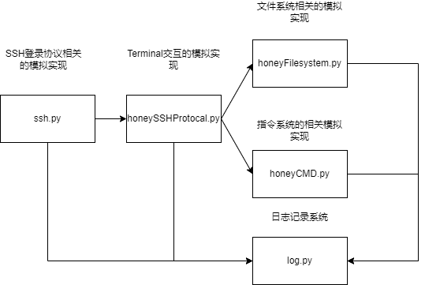

- ssh.py: 该文件模拟了ssh协议，实现了登录的功能，能够与正常的ssh client交互
- honeySSHProtocol.py: 该文件模拟了bash terminal的相关功能，例如ctrl+c强制停止等terminal提供的功能
- honeyFilesystem.py: 该文件模拟了文件系统的相关操作，如创建文件，删除文件等
- honeyCMD.py: 该文件用于模拟常用指令，如ls, whoami, cat等
- log.py: 该文件用于记录攻击的流程，对应上面的图，记录ssh协议时登录使用的账号密码、Terminal交互时的相关信息、执行的命令(todo: 产生的文件)。

代码部分，对Twisted的SSH部分进行了重构，添加了许多所需的代码。

## 三、项目测试

### 3.1 项目配置

#### 3.1.1 setup.conf文件的配置

可以配置登录用户的账户与口令，支持多个用户

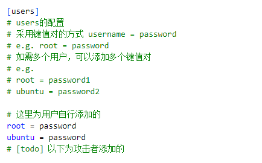

其余配置，如SSH客户端的版本号，主机名等都可以在setup.conf中进行配置，其余的配置可以保持默认。

#### 3.1.2 在本机启动

如果没有安装虚拟环境virtualenv，则需要安装：

```bash
pip install virtualenv
```

接着是启动：

```bash
virtualenv venv
source venv/bin/activate
pip install -r requirements.txt
python3 run.py
```

默认允许在5022端口，如若需要，可使用nginx等将服务映射到22端口。

#### 3.1.3 docker compose 启动

需要安装docker以及docker-compose:

ubuntu
```bash
sudo apt install docker.io docker-compose
```

然后在项目根目录下执行：
```bash
sudo docker-compose up -d
```

初次执行，需要构建镜像，较为缓慢。

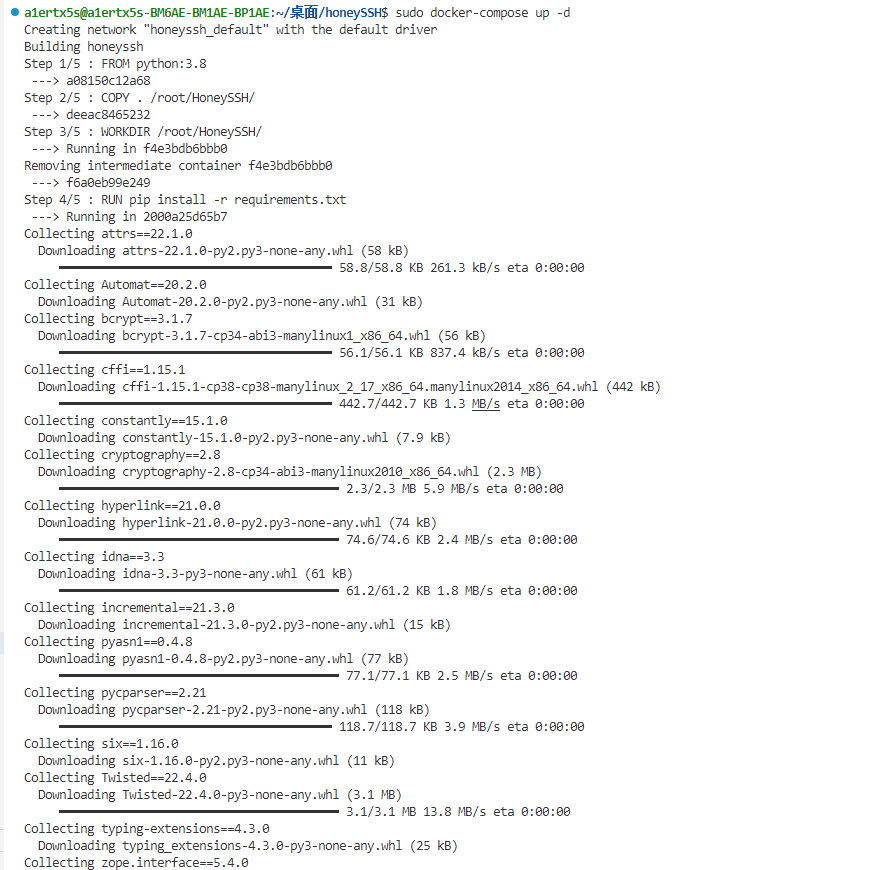


如若需要，可以在docker-compose.yml中修改映射端口。

### 3.2 攻击模拟

#### 3.2.1 口令猜测登录

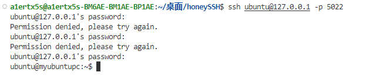

#### 3.2.2 执行常见指令

**1. cd & pwd**
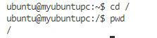

**2. ls**
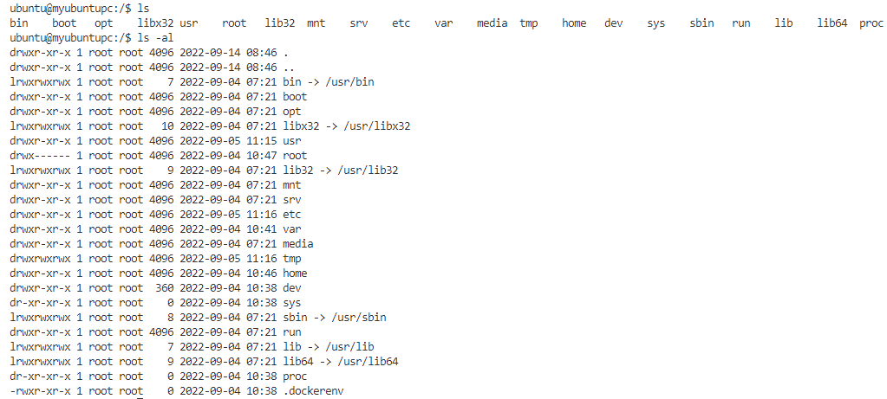

**3. whoami**


**4. mkdir & touch**
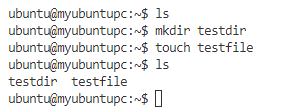

**5. rm**
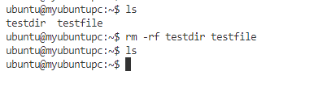

**6. cat**
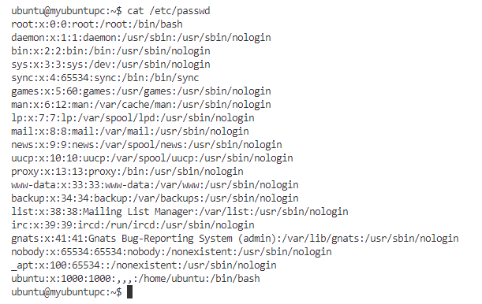

**7. ping**
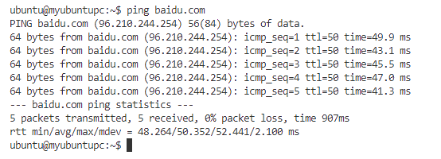

【todo】 wget指令等自动化攻击常用到的指令

### 3.3 结果展示

由于时间有限，没有实现后台模块的展示部分，只以json的形式，将日志信息存储下来。

在攻击者进行攻击时，就会生成对应时间的日志文件。

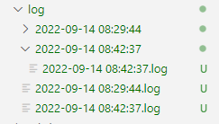

一次攻击产生的日志文件如下：

```json
{
    "loginInfo": {
        "ip": "172.27.0.1",
        "port": 39006,
        "login time": "2022-09-14 08:42:37",
        "username and password": "log/2022-09-14 08:42:37/2022-09-14 08:42:37.log",
        "remote SSH version": "SSH-2.0-OpenSSH_8.2p1 Ubuntu-4ubuntu0.5"
    },
    "commands": [
        {
            "time": "2022-09-14 08:44:09",
            "command": "cd /"
        },
        {
            "time": "2022-09-14 08:44:12",
            "command": "ls -al"
        },
        {
            "time": "2022-09-14 08:44:31",
            "command": "clear"
        },
        {
            "time": "2022-09-14 08:44:35",
            "command": "cd ~"
        },
        {
            "time": "2022-09-14 08:44:38",
            "command": "cd /"
        },
        {
            "time": "2022-09-14 08:44:40",
            "command": "pwd"
        },
        {
            "time": "2022-09-14 08:46:24",
            "command": "ls"
        },
        {
            "time": "2022-09-14 08:46:27",
            "command": "ls -al"
        },
        {
            "time": "2022-09-14 08:47:30",
            "command": "tree"
        },
        {
            "time": "2022-09-14 08:47:34",
            "command": "clear"
        },
        {
            "time": "2022-09-14 08:47:41",
            "command": "whoami"
        },
        {
            "time": "2022-09-14 08:48:11",
            "command": "ls"
        },
        {
            "time": "2022-09-14 08:48:15",
            "command": "clear"
        },
        {
            "time": "2022-09-14 08:48:32",
            "command": "cd ~"
        },
        {
            "time": "2022-09-14 08:48:34",
            "command": "clear"
        },
        {
            "time": "2022-09-14 08:48:39",
            "command": "mkdir test"
        },
        {
            "time": "2022-09-14 08:48:40",
            "command": "ls"
        },
        {
            "time": "2022-09-14 08:49:02",
            "command": "rm test"
        },
        {
            "time": "2022-09-14 08:49:06",
            "command": "rm -r test"
        },
        {
            "time": "2022-09-14 08:49:07",
            "command": "clear"
        },
        {
            "time": "2022-09-14 08:49:09",
            "command": "ls"
        },
        {
            "time": "2022-09-14 08:49:15",
            "command": "mkdir testdir"
        },
        {
            "time": "2022-09-14 08:49:20",
            "command": "touch testfile"
        },
        {
            "time": "2022-09-14 08:49:22",
            "command": "ls"
        },
        {
            "time": "2022-09-14 08:50:48",
            "command": "rm -rf testdir testfile"
        },
        {
            "time": "2022-09-14 08:50:49",
            "command": "ls"
        },
        {
            "time": "2022-09-14 08:51:37",
            "command": "clear"
        },
        {
            "time": "2022-09-14 08:51:45",
            "command": "cat /etc/passwd"
        },
        {
            "time": "2022-09-14 08:52:36",
            "command": "clear"
        },
        {
            "time": "2022-09-14 08:52:41",
            "command": "ping baidu.com"
        }
    ]
}
```

其中基础信息包含攻击者的IP、端口、SSH client的版本等。

还含有攻击者执行的每一条指令。

同时还会将登录时猜测使用的账号密码进行记录，如果将密码设为无法短时间攻破的密码，则可以用来进行爆破字典的收集。

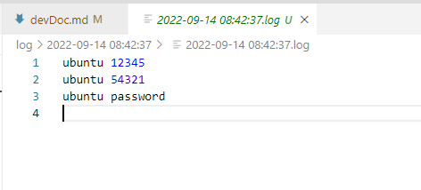
